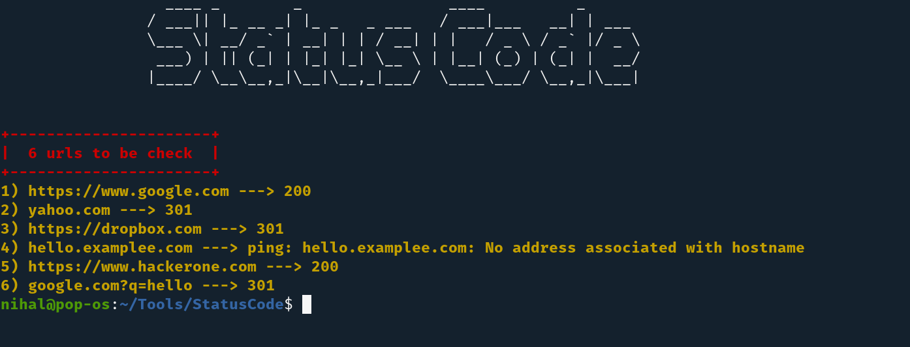

<h1 align="center">
   
  
   
  Extractor
   
</h1>

<h4 align="center">StatusCode will check the HTTP status code of urls from a given file.</h4>

#### HTTP status Checker
StatusCode is written in Bash Shell Scripting and will check the HTTP status code of urls from the file given as argument.
It uses curl command with -I flag to solely request headers of reponse and with cut command it cuts the status code from it.
